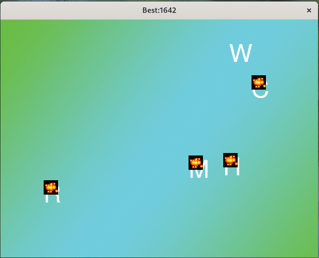

# shotABC
This is a typing speed game where five letters randomly appear on the screen. The player must press the corresponding keys as quickly as possible. The game tracks the time taken to complete each round, and the shortest completion time earns the top score.

这是一款打字竞速游戏：五个字母随机闪现屏幕，玩家需以最快手速敲击对应按键！系统将记录每轮完成所用时间——最短用时者将登顶排行榜！

## Licence
MIT License - see LICENSE for more details
